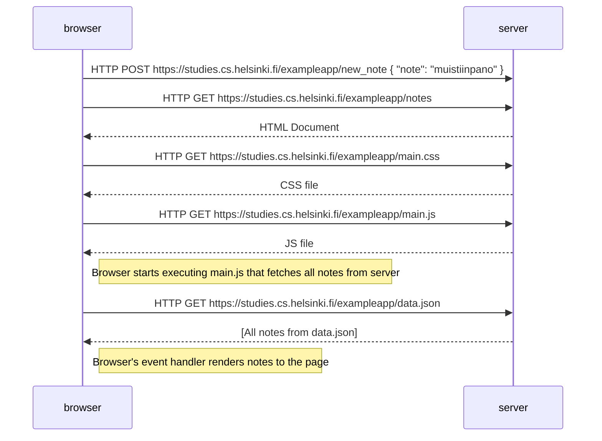

```mermaid
sequenceDiagram
    participant browser
    participant server
    
    browser->>server: HTTP POST https://studies.cs.helsinki.fi/exampleapp/new_note { "note": "muistiinpano" }
    
    browser->>server: HTTP GET https://studies.cs.helsinki.fi/exampleapp/notes
    server-->>browser: HTML Document

    browser->>server: HTTP GET https://studies.cs.helsinki.fi/exampleapp/main.css
    server-->>browser: CSS file

    browser->>server: HTTP GET https://studies.cs.helsinki.fi/exampleapp/main.js
    server-->>browser: JS file

    note right of browser: Browser starts executing main.js that fetches all notes from server

    browser->>server: HTTP GET https://studies.cs.helsinki.fi/exampleapp/data.json
    server-->>browser: [All notes from data.json]

    note right of browser: Browser's event handler renders notes to the page

    


```
