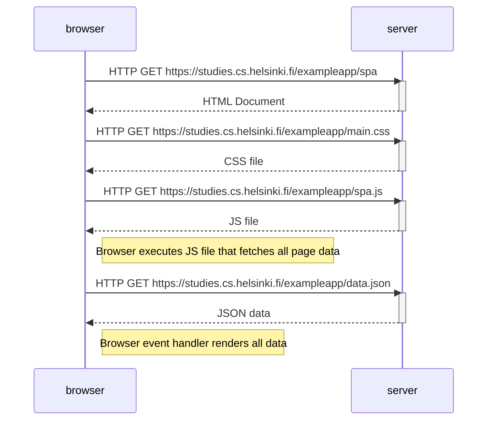

```mermaid

sequenceDiagram
  participant browser
  participant server
  
  browser->>server: HTTP GET https://studies.cs.helsinki.fi/exampleapp/spa
  activate server
  server-->>browser: HTML Document
  deactivate server

  browser->>server: HTTP GET https://studies.cs.helsinki.fi/exampleapp/main.css
  activate server
  server-->>browser: CSS file
  deactivate server

  browser->>server: HTTP GET https://studies.cs.helsinki.fi/exampleapp/spa.js
  activate server
  server-->>browser: JS file
  deactivate server

  note right of browser: Browser executes JS file that fetches all page data


  browser->>server: HTTP GET https://studies.cs.helsinki.fi/exampleapp/data.json
  activate server
  server-->>browser: JSON data
  deactivate server

  note right of browser: Browser event handler renders all data


```

