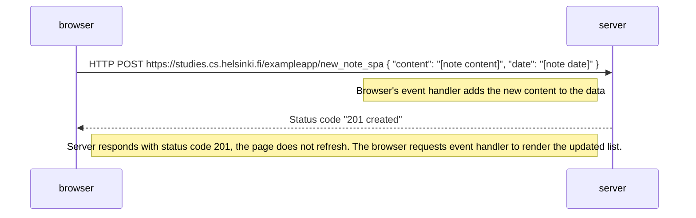

```mermaid

sequenceDiagram
  participant browser
  participant server
  
  
  browser->>server: HTTP POST https://studies.cs.helsinki.fi/exampleapp/new_note_spa { "content": "[note content]", "date": "[note date]" }
  
  note left of server: Browser's event handler adds the new content to the data
  
  server-->>browser: Status code "201 created"
  
  note right of browser: Server responds with status code 201, the page does not refresh. The browser requests event handler to render the updated list.


 


```

